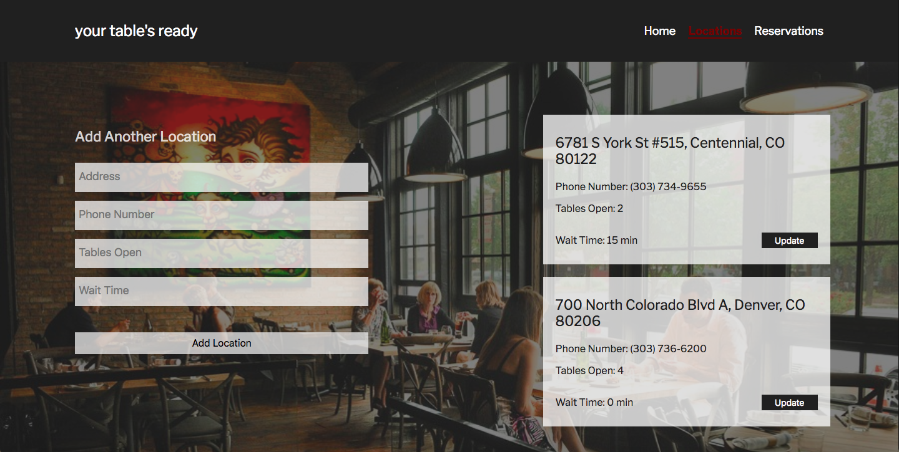

# your table's ready (business side)

## About 
This was my idea I had for one of my final projects at Turing School of Software and Design. The purpose of "your table's ready" was to make making restaurant reservations in an easier fashion. The admin side of this project is intended to be used by restaurants in order for them to keep track of reservations made by customers. It also allows the restaurant to update the amount of tables available and the current wait time in order to inform customers. 

## Tech Stack 

* JavaScript 
* React
* Redux

## Set Up

* Clone down repo
* `npm install`
* `npm start`
* Open localhost:3000 in the browser

## Screen Shots

